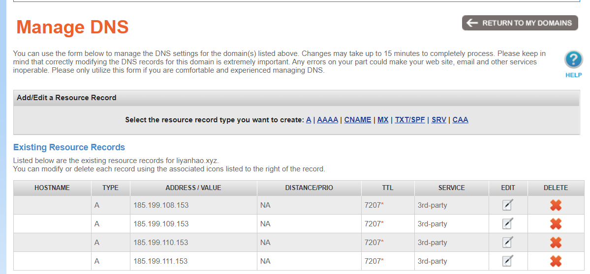

# 使用hugo快速搭建博客

## 1. 安装hugo
* ### Windows安装方式
  + hugo官网Hugo下载hugo.exe并将hugo.exe所在路径添加至path中
  + 运行hugo version查看版本
  
## 2.快速搭建博客
* 看文档搞出网站
  + 进入Hugo官网,点击Quick Start快速开始
  + 从Step 2开始抄代码，直到Step 7
  + 得到一个public目录，这就是我们的博客站点
  + hugo server-D可以预览草稿
  + hugo server可以预览非草稿

* 预览网站
  + 双击打开public/index.html发现不能预览
  + 因为public/index.html不能使用文件协议预览
  + 请使南hugo server预览

## 3. 个人GitHub仓库
* 创建一个GitHub repo
  + 仓库名为：你的GitHub用户名.github.io
  + 怎么查看自己的GitHub用户名？点头像、profile
  + 创建的时候什么都不要勾选
  ## 4. 又一次创建本地仓库
* 步骤
  + 进去public
  + git init
  + git add .
  + git commit -m hello
* 关联远程仓库
  + git remote add origin
git @ github.com:xxxx/x.github.io.git
  + 注意必须是git@开头
  + git push -u origin master

## 打开打开 x.github.io 的 GitHub Pages

## 5. 配置域名dns
* 在github的help列表中查找DNS 
* 将DNS填入记录值中 完成域名配置
  

  ## 6.添加域名至github 
* 
  进入<github用户名>.github.io仓库的设置页面 找到Custom domain选项卡 填入买好的域名 完成添加
